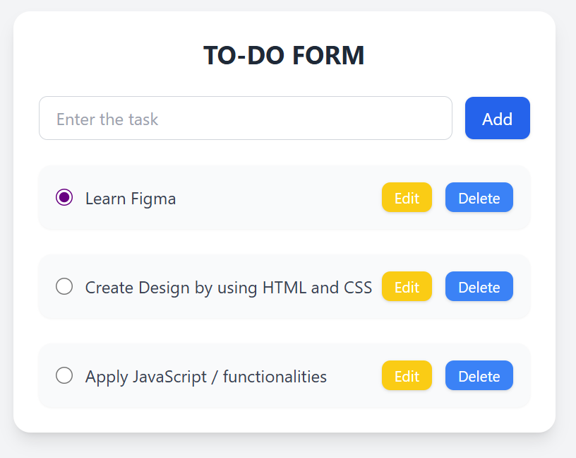

---

```markdown
# 📝 To-Do List Web Application  
---

## 📌 Project Description 

The **To-Do List Application** empowers users to stay organized by adding, completing, and deleting tasks with a clean and user-friendly interface.  
This project demonstrates key frontend engineering skills, including semantic HTML structuring, responsive design, DOM manipulation, and persistent data storage with `localStorage`.  

---

## ✨ Features  

### ✅ Core Features  
- **Add Tasks:** Create new tasks quickly and easily.  
- **Mark Complete/Incomplete:** Toggle task status with clear visual indicators (e.g., strikethrough for completed tasks).  
- **Delete Tasks:** Remove tasks instantly without reloading the page.  
- **Persistent Data:** Tasks are stored in `localStorage` and remain available even after reloading or closing the browser.  

### 🚀 Advanced Features (Optional)  
- **Inline Task Editing:** Edit tasks directly from the task list.  
- **Task Categories:** Group tasks by categories (Work, Personal, School).  
- **Dark Mode Toggle:** Switch between light and dark themes using Tailwind utilities.  
- **Priority Levels:** Assign High/Medium/Low priority tags with distinct visual styling.  
- **Search & Filtering:** Quickly find tasks or filter them by status/priority.  

---

## 🛠️ Technologies Used  

- **HTML5** – Semantic and accessible structure  
- **Tailwind CSS** – Responsive and modern UI styling  
- **JavaScript (Vanilla)** – Dynamic interactivity & DOM manipulation  
- **LocalStorage** – Persistent task storage  

---

## 📂 Folder Structure  

```

/to-do-list
│── /pages
│   ├── index.css     
│   ├── index.js      
│   └── images/        
│── index.html       
│── README.md        

````

---

## ⚙️ Setup Instructions  

Follow these steps to run the project locally:  

1. **Clone the repository:**  
   ```bash
   git clone https://github.com/racheluwera/to-do-list.git
````

2. **Navigate into the project folder:**

   ```bash
   cd to-do-list
   ```
3. **Open `index.html` in your browser** or use a local development server (e.g., Live Server extension in VS Code).

---

## 🖱️ Usage Guide

1. **Add a Task:**
   Type a task in the input field and click **Add** (or press Enter).

2. **Mark Complete/Incomplete:**
   Click on a task to toggle its completion status (strikethrough indicates completed).

3. **Delete a Task:**
   Click the delete (🗑) icon next to a task to remove it from the list.

4. **Persistent Tasks:**
   All tasks will remain saved even after refreshing or reopening the page.

---

## 📸 Screenshots

| Desktop View                                          | Mobile View                                         |
| ----------------------------------------------------- | --------------------------------------------------- |
| ! 

---

## 🎯 Expected Outcome

By completing this project, you will deliver:

* A **professional, responsive, and accessible** UI.
* An **interactive, user-friendly** task management system.
* **Persistent task storage** that simulates state management used in production apps.
* Clean, scalable, and maintainable code — suitable for inclusion in your portfolio.

---

## 👩‍💻 Author

**Rachel Uwera**
